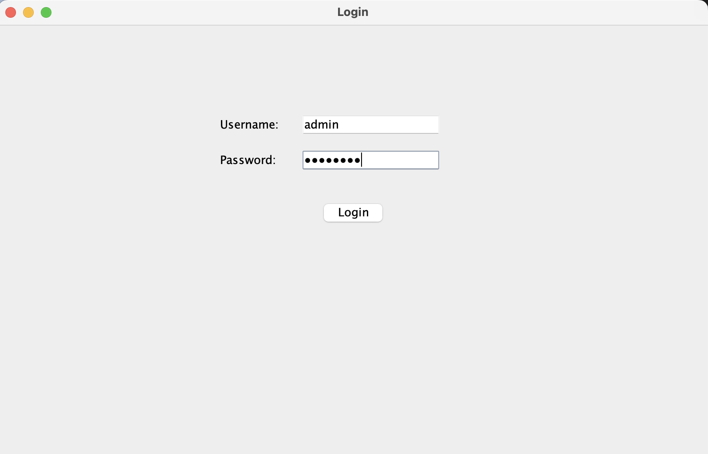
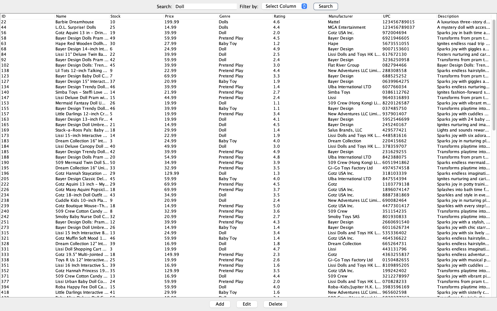
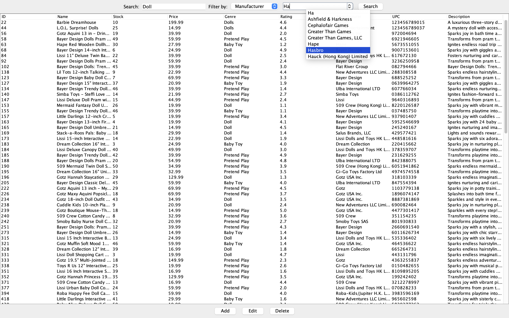
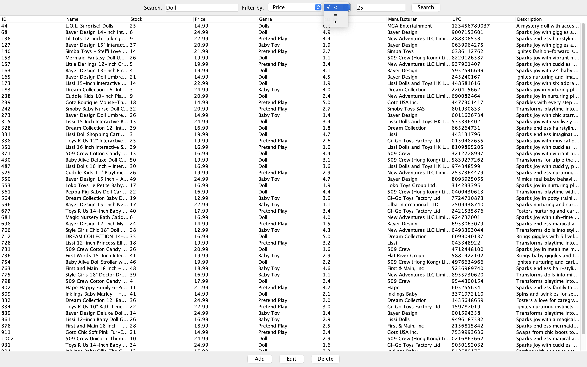
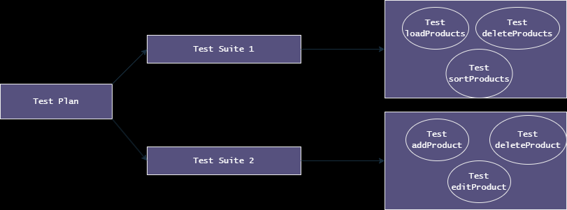

# Toys And Games Catalogue
Rapos Inc.
Group: Sully Butt, Aedin Cowan, Jaathavan Ranjanathan, Caelen Sharma, Dillon Toshack

## Project Description
This is a catalogue for the toys and games domain. Currently, users can:
- **View the Catalogue:** Displays products with details such as product ID, name, amount in stock, price, genre, rating, manufacturer, UPC, and description.
- **Add to the Catalogue:** Let users input a new product with parameters matching the viewing information.
- **Edit the Catalogue:** Allow users to change product information (e.g. product ID, name, stock, and price).
- **Delete from the Catalogue:** Remove a product based on its product ID.
- **Search and Filter:**
  - **Search:** Users can enter a search term to look up products.
  - **Filtering:** Supports both categorical (autocomplete-based for Product Name, Genre, Manufacturer) and non-categorical (numeric fields such as Price, Stock, Rating) filtering.  
    - Categorical filters use an auto‑complete dropdown for suggestions.
    - Numeric filters use an operator dropdown (e.g., `<`, `>`, `=`) along with a free‑text input for the value.

## UML Class Diagram


## Installation Instructions

1. **Clone the Repository**  
    Clone the project repository from GitHub:
    ```bash
    git clone https://github.com/CaelenS/RaposInc-2040U-Lab
    ```

2. **Install Dependencies**  
    Ensure that you have the necessary dependencies installed:  
    - **Java JDK 8** (or above)  
    - **Java Swing** (included in the JDK)  
    - **JDBC Driver** (e.g., for PostgreSQL)  
    - **Maven** (optional, if using Maven for dependency management)

3. **Database Setup**  
    Note: The database is already set up. All you need to do is ensure that the .env file in the resources folder contains the correct key and credentials. If you wish to set up your own server using SQL, follow the remaining steps below:
    - Create a new database in PostgreSQL (or your preferred RDBMS).
    - Create a .env file in the project root with your database configuration details (database URL, username, and password).
    - Run the SQL scripts in the sql/ folder to set up the schema and initial data.   - Create a new database in PostgreSQL (or your preferred RDBMS).

4. **Compile & Build**  
    - Open the project in your preferred IDE (e.g., IntelliJ IDEA).
    - Use Maven (via the `pom.xml`) to compile and build the project.
    - Run the `LoginGUI.java` file to launch the graphical user interface.

## How to Use
Follow these steps to manage and interact with the catalogue:

## Login and User Roles
Upon launching the application via the Login GUI, you will be prompted to enter your credentials. There are two types of users:

- **Admin:**  
    Admin users have full access to the catalogue. They can:
    - Add new products.
    - Edit existing products.
    - Delete products.
    - View, search, and filter the catalogue.

- **Employee:**  
    Employee users have limited permissions. They can:
    - View the catalogue.
    - Search and filter the catalogue.



Make sure to log in with the appropriate credentials to access the corresponding features of the application.

1. **View Products**  
    - Run the application using `ProductCatalogueGUI.java`.  
    - Browse through the products list and use available filters to search for specific items.


2. **Add New Product**  
    - Click the "Add" button to open the product creation form.  
    - Fill in the required details and submit the form to add a new product to the catalogue.


3. **Edit Existing Product**  
    - Select a product from the list.  
    - Click the "Edit" button to modify product details.  
    - Update the fields as needed and save the changes.


4. **Remove Product**  
    - Choose a product from the catalogue.  
    - Click the "Remove" button and confirm the deletion when prompted.


5. **Search and Filter Products**  
    - **Search Products:**  
      - Use the search bar at the top of the catalogue view to type in any keyword or product detail (e.g., Product Name, Manufacturer, Genre, UPC, Description).  
      - The system will dynamically display any matching results.
        

    - **Filter Products:**  
      - **Categorical Filters:**  
         - Utilize the dropdowns provided next to categorical fields (such as Product Name, Genre, Manufacturer) which support auto‑complete suggestions.  
         - Select a value from the list to narrow down the results.
            
      - **Numerical Filters:**  
         - Choose the appropriate operator (e.g., `<`, `>`, `=`) from the dropdown available for numerical fields such as Price, Stock, or Rating.  
         - Enter the desired number in the adjacent text box to filter the products accordingly.
           

    These functionalities help you quickly locate specific products and refine the catalogue view based on your search criteria.

## Video:
<video controls src="video.mp4" title="Video Demonstration"></video>

## TDD: Test Suite
The project includes a suite of unit and integration tests located in the `Tests/` folder. These tests validate:
- The functionality of the GUI components (e.g., product loading, deletion).
- Database operations via `ProductFunctions` and other service classes.

A screenshot of the test results is provided below:  

