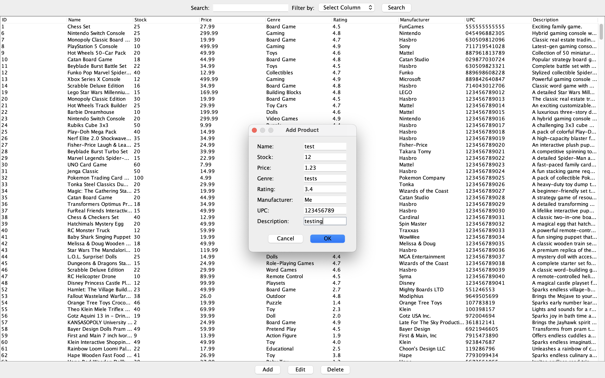
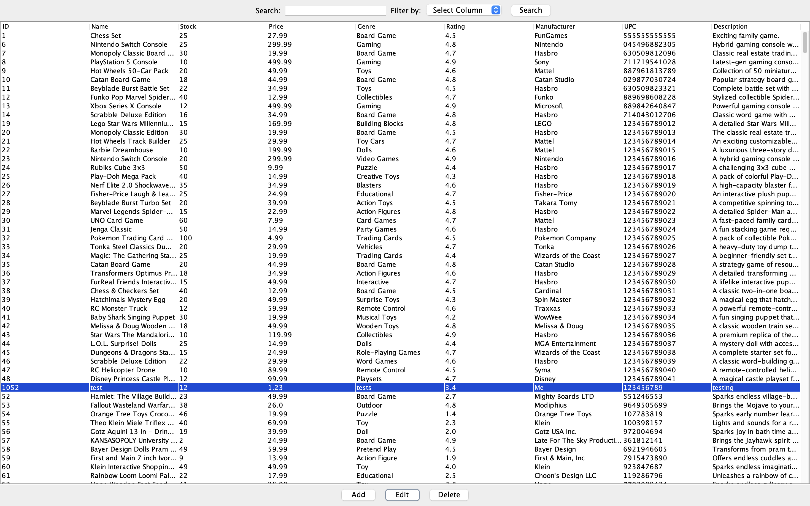

# Toys And Games Catalogue
Rapos Inc.
Group: Sully Butt, Aedin Cowan, Jaathavan Ranjanathan, Caelen Sharma, Dillon Toshack

## Project Description
This is a catalogue for the toys and games domain. Currently, users can:
- View the catalogue: displays the product ID, name, amount in stock, price, genre, rating, manufacturer, UPC, and description.
- Add to the catalogue: allows the user to input a new product using the same parameters as view (product ID, name, stock, price, genre, rating, manufacturer, UPC, and description).
- Edit the catalogue: allows the user to change product parameters such as product ID, name, stock, and price.
- Delete from the catalogue: removes a product based on an inputted product ID.

## UML Class Diagram


## Installation Instructions

1. **Clone the Repository**  
    Clone the project repository from GitHub:
    ```bash
    git clone https://github.com/CaelenS/RaposInc-2040U-Lab
    ```

2. **Install Dependencies**  
    Ensure that you have the necessary dependencies installed:  
    - **Java JDK 8** (or above)  
    - **Java Swing** (included in the JDK)  
    - **JDBC Driver** (e.g., for PostgreSQL)  
    - **Maven** (optional, if using Maven for dependency management)

3. **Database Setup**  
    - Create a new database in PostgreSQL (or your preferred RDBMS).  
    - Create a `.env` file in the project root and enter the appropriate key(s) for your database configuration (e.g., database URL, username, and password).

4. **Run the Program**  
    - Compile the Java files.  
    - Run the `ProductCatalogueGUI.java` file to launch the graphical user interface.


## How to Use
Follow these steps to manage and interact with the catalogue:

1. **View Products**  
    - Run the application using `ProductCatalogueGUI.java`.  
    - Browse through the products list and use available filters to search for specific items.


2. **Add New Product**  
    - Click the "Add" button to open the product creation form.  
    - Fill in the required details and submit the form to add a new product to the catalogue.


3. **Edit Existing Product**  
    - Select a product from the list.  
    - Click the "Edit" button to modify product details.  
    - Update the fields as needed and save the changes.


4. **Remove Product**  
    - Choose a product from the catalogue.  
    - Click the "Remove" button and confirm the deletion when prompted.
